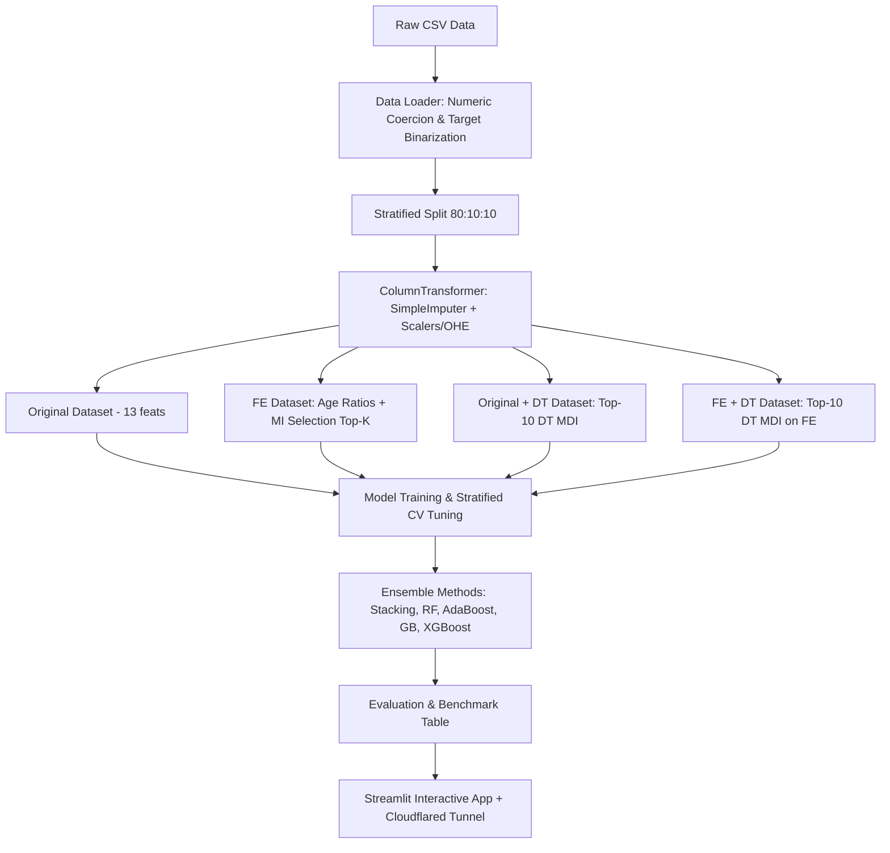

# Baseline Guide: Heart Disease Diagnosis Using Machine Learning

This guide outlines the mathematical principles, workflow steps, and implementation instructions for reproducing the paper's baseline experiments (Part 1 and Part 2).

---

## 1. Problem Definition & Clinical Data Schema

The **Cleveland Heart Disease Dataset** contains 303 patient records with 13 predictive attributes and 1 diagnosis label.

### Attribute Mapping
| Feature Name | Description | Clinical Interpretation |
| :--- | :--- | :--- |
| `age` | Age in years | Cardiovascular risk increases with age |
| `sex` | Biological sex | 1 = Male; 0 = Female |
| `cp` | Chest Pain Type | 1: Typical Angina, 2: Atypical Angina, 3: Non-Anginal, 4: Asymptomatic |
| `trestbps` | Resting Blood Pressure | mm Hg on hospital admission |
| `chol` | Serum Cholesterol | mg/dl |
| `fbs` | Fasting Blood Sugar > 120 mg/dl | 1 = True; 0 = False (indicates diabetes / insulin resistance) |
| `restecg` | Resting ECG results | 0: Normal, 1: ST-T wave abnormality, 2: Left Ventricular Hypertrophy |
| `thalach` | Maximum heart rate achieved | Measured during stress treadmill test |
| `exang` | Exercise Induced Angina | 1 = Yes; 0 = No |
| `oldpeak` | ST Depression | Exercise-induced depression relative to resting baseline |
| `slope` | Slope of Peak Exercise ST | 1: Upsloping, 2: Flat, 3: Downsloping |
| `ca` | Fluoroscopy Vessel Count | Number of major vessels (0–3) colored by fluoroscopy |
| `thal` | Thalassemia | 3 = Normal, 6 = Fixed Defect, 7 = Reversible Defect |
| `target` | Diagnosis of CAD | 0 = No Disease (< 50% narrowing), 1–4 = Disease (> 50% narrowing) |

---

## 2. Step-by-Step Implementation Workflow



### Step 2.1: Data Ingestion & Target Binarization
- Load raw CSV without headers: `pd.read_csv("cleveland.csv", header=None)`.
- Set column names from `ALL_COLUMNS`.
- Replace string missing symbols (`'?'`) by coercing to numeric float: `pd.to_numeric(df[col], errors='coerce')`.
- Binarize diagnosis target: `df['target'] = (df['target'] > 0).astype(int)`.

### Step 2.2: Data Leakage Prevention & Stratified Splitting
- Split into Train (80%), Val (10%), and Test (10%).
- **Crucial:** Always pass `stratify=y` to preserve the positive/negative disease ratio.
- **Rule:** `pipeline.fit_transform(X_train, y_train)` on Train split ONLY. Apply `pipeline.transform(X_val)` and `pipeline.transform(X_test)`.

### Step 2.3: Feature Engineering (FE)
Compute physiological interaction terms:
1. `chol_per_age = chol / age`
2. `bps_per_age = trestbps / age`
3. `hr_ratio = thalach / age`
4. `age_bin = pd.cut(age, bins=5, labels=False)`

### Step 2.4: Feature Selection
1. **Mutual Information (MI):**
   $$I(X; Y) = \sum_{x \in X} \sum_{y \in Y} p(x,y) \log \frac{p(x,y)}{p(x)p(y)}$$
   Use `mutual_info_classif(Xt_tr.values, y_train.values, discrete_features=is_discrete, random_state=42)` and rank features to select Top-$K$ ($K=13$).
2. **Decision Tree Mean Decrease in Impurity (MDI):**
   Fit `DecisionTreeClassifier(random_state=42)` and rank by `feature_importances_` to select Top-10 features.

---

## 3. Machine Learning Model Algorithms

### 1. Gaussian Naive Bayes (`GaussianNB`)
Assumes conditional independence of attributes given class $y$:
$$P(y \mid x_1, \dots, x_n) \propto P(y) \prod_{i=1}^n P(x_i \mid y)$$

### 2. K-Nearest Neighbors (`KNN`)
- Distance metric: Euclidean distance $d(x, z) = \sqrt{\sum (x_i - z_i)^2}$.
- Hyperparameter tuning: Loop $K \in [1, 20]$ using `StratifiedKFold(n_splits=5)` and `cross_val_score`.

### 3. Decision Tree (`DecisionTreeClassifier`)
- Splitting criterion: Gini Impurity $Gini(t) = 1 - \sum p_i^2$ or Entropy.
- Hyperparameter tuning: Loop `max_depth` $\in [2, 10]$ via Stratified 5-Fold CV.

### 4. K-Means Clustering Classifier
- Fit `KMeans(n_clusters=2, init='random', random_state=42)` on training features.
- Map cluster IDs to labels using training set mode:
  ```python
  cluster_class_mapping = {
      cluster_id: Counter(y_train[train_clusters == cluster_id]).most_common(1)[0][0]
      for cluster_id in np.unique(train_clusters)
  }
  ```

### 5. Stacking Ensemble
- Base Estimators: KNN, Decision Tree, Gaussian Naive Bayes.
- Final Estimator (Meta-Classifier): KNN with `stack_method='predict_proba'`.

### 6. Random Forest (Bagging)
- Trains $B$ independent deep trees on Bootstrap samples $\mathcal{D}_b$.
- Features randomly sampled at each split: $m = \sqrt{p}$.
- Optimizes `n_estimators` $\in [50, 500]$ with step 50.

### 7. AdaBoost (Boosting)
- Trains sequential Decision Stumps ($max\_depth=1$).
- Updates sample weights: misclassified samples receive higher weights.
- Optimizes `n_estimators` $\in [50, 500]$.

### 8. Gradient Boosting (GB)
- Fits trees sequentially on pseudo-residuals (negative gradient of logloss).
- Shrinkage: $F_m(x) = F_{m-1}(x) + \eta \cdot h_m(x)$ ($\eta = 0.1$).

### 9. XGBoost
- Uses 2nd-order Taylor approximation for the loss function.
- Adds $L_1$ and $L_2$ regularization on leaf weights.
- Employs histogram splitting (`tree_method='hist'`).

---

## 4. Expected Performance Benchmark Target

| Model | Val (Origin) | Val (FE) | Val (Origin+DT) | Val (FE+DT) | Test (Origin) | Test (FE) | Test (Origin+DT) | Test (FE+DT) |
| :--- | :---: | :---: | :---: | :---: | :---: | :---: | :---: | :---: |
| **Naive Bayes** | 0.90 | 0.90 | 0.93 | 0.93 | 0.84 | 0.84 | 0.84 | 0.84 |
| **KNN** | 0.90 | 0.90 | 0.97 | 0.87 | 0.84 | 0.84 | 0.87 | 0.84 |
| **K-Means** | 0.70 | 0.80 | 0.83 | 0.63 | 0.87 | 0.87 | 0.84 | 0.77 |
| **Decision Tree** | 0.93 | 0.93 | 0.93 | 0.93 | 0.81 | 0.81 | 0.81 | 0.81 |
| **Stacking** | 0.87 | 0.93 | 0.90 | 0.87 | 0.84 | **0.90** | 0.84 | 0.84 |
| **Random Forest** | **0.97** | 0.90 | **0.97** | 0.93 | **0.90** | 0.87 | 0.84 | 0.84 |
| **AdaBoost** | **0.97** | **0.97** | **0.97** | 0.93 | 0.81 | 0.84 | 0.81 | 0.84 |
| **Gradient Boosting**| 0.87 | 0.83 | 0.87 | 0.93 | 0.81 | 0.81 | 0.84 | 0.81 |
| **XGBoost** | 0.90 | 0.87 | 0.93 | 0.90 | 0.84 | 0.87 | 0.81 | 0.87 |
